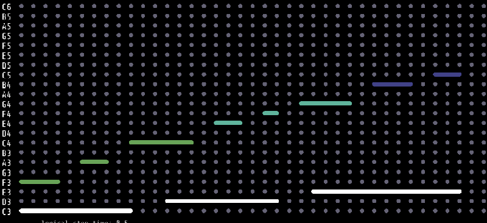
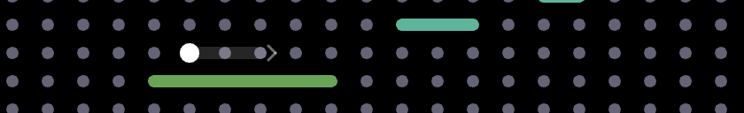
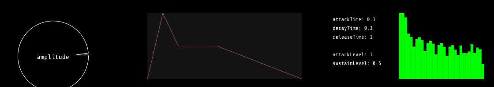

<p align="center">
  <a href="https://e3ve35.github.io/GOMI/" rel="noopener">
 </a>
</p>

<h3 align="center">Graphical Online Music Interface</h3>

<div align="center">


[](https://github.com/e3ve35/GOMI/issues)
[](https://github.com/e3ve35/GOMI/pulls)
[](/LICENSE)

</div>

---

<p align="center"> <a href="https://e3ve35.github.io/GOMI/">An interactive composition tool</a>
    <br> 
</p>

## 📝 Table of Contents

- [📝 Table of Contents](#-table-of-contents)
- [🧐 About ](#-about-)
- [🏁 How to Use ](#-how-to-use-)
  - [Canvas](#canvas)
  - [Graphs and Visualizations](#graphs-and-visualizations)
  - [Tools](#tools)
  - [Running it locally](#running-it-locally)
- [✍️ Author ](#️-author-)
- [🎉 Acknowledgements ](#-acknowledgements-)

## 🧐 About <a name = "about"></a>

The [Graphical Online Music Interface](https://e3ve35.github.io/GOMI/) is a website that enables users to create music compositions through visual interactions. The goal of this project is to simplify the process of composing and adjusting computer music scores by visualizing sound synthesis parameters and providing real-time audible feedback. My motivation for starting this project was to enhance the user experience of computer music composition and make it more accessible for everyone.

## 🏁 How to Use <a name = "how-to-use"></a>

Open the interface here: **[e3ve35.github.io/GOMI](https://e3ve35.github.io/GOMI/)**

> There is also a short [video](https://drive.google.com/file/d/1C2H45D9KcqhJANld2xrkzmR-PqM5Wae2/view?usp=sharing) walkthrough, but it shows an earlier version of GOMI — recorded before notes had length and before the grid became scale-based.

  ### Canvas
  - The upper half of the page is the canvas. To start, click the **"click to create a score"** button.
  - You will then see a grid of dots. The vertical axis is pitch and the horizontal axis is time. Each row is a degree of the chosen scale across three octaves (C3 up to C6 by default), so every dot on the grid is in key — there is no wrong note to land on.
    <p align="center">
      
    </p>
  - **Writing a note.** Press a dot and it sounds immediately, holding for as long as the mouse is down. Drag either way and release to give the note a length: the dot stretches into a capsule spanning the columns it covers, growing from the dot you pressed rather than only to its right. A press with no drag makes the shortest possible note.
  - Hovering an empty dot previews that gesture — the dot brightens and a faint capsule with an arrow shows how far you could drag rightward. It stops short when another note is in the way, so it never offers room you cannot actually take.
    <p align="center">
      
    </p>
  - **Gliding between notes.** Drag out of a note's row to join it to another: a line connects the two, and on playback the earlier note slides in pitch across its own length, arriving at the second note's pitch as it ends. The slide is even in semitones per second rather than in hertz, so it rises and falls at a steady musical rate. It works from an empty dot as well as an existing note — drag sideways to set a length as usual, then away to another row, and releasing on an empty dot writes the note at that end for you. Notes in the same row, or that overlap in time, cannot be joined. Dragging an existing note onto empty space removes the glide it had.
  - **Erasing.** Click a note again to remove it. Clicking anywhere along a long note removes the whole note.
  - **Wave type.** Choose between sine, triangle, sawtooth, and square. Each colours its notes differently on the canvas: sine is white, triangle green, sawtooth teal, and square blue — so you can read the arrangement at a glance.
  - **Root and scale.** Two dropdowns beside the wave selector set the root note and the scale (major, minor, dorian, major pentatonic, minor pentatonic). Changing either re-tunes the whole grid. Your notes keep their positions and are re-pitched into the new scale, so switching from major to minor transposes what you have written rather than discarding it.
  - **logical-stop-time.** The slider on the left sets how long a single column lasts, in seconds.

  ### Graphs and Visualizations
  <p align="center">
    
  </p>

  - **amplitude** (left) — a circle whose shape deforms as the loudness of your composition fluctuates. (Implemented following this [tutorial](https://www.youtube.com/watch?v=jEwAMgcCgOA&list=PLRqwX-V7Uu6aFcVjlDAkkGIixw70s7jpW&index=10&ab_channel=TheCodingTrain) by The Coding Train.)
  - **envelope** (middle) — the [ADSR](https://en.wikipedia.org/wiki/Envelope_(music)) shape applied to every note. The sliders beside it set attack, decay and release times plus attack and sustain levels; adjust them and the next note you play sounds different.
  - **frequency** (right) — a Fourier transform of whatever is sounding right now, showing the amplitude of each frequency component.

  ### Tools
  - **play** renders your score over time, starting from the leftmost column. Notes light up as they sound, and each one holds for the length you drew.
  - **clear** empties the canvas and stops anything currently playing.
  - **generate nyquist score** downloads a `score.txt` in [Nyquist](https://www.cs.cmu.edu/~rbd/doc/nyquist/) format, which you can paste into the Nyquist IDE and play with your own instrument definitions. Each entry is `{start duration {instrument pitch: midi}}`, and the durations match the lengths you drew. This is the exact export of the score pictured above:
    ```
    {
     {0.00 5.00 {sine-instr pitch: 48}} 
     {0.00 2.00 {triangle-instr pitch: 53}} 
     {2.50 1.50 {triangle-instr pitch: 57}} 
     {4.50 3.00 {triangle-instr pitch: 60}} 
     {6.00 5.00 {sine-instr pitch: 50}} 
     {8.00 1.50 {sawtooth-instr pitch: 64}} 
     {10.00 1.00 {sawtooth-instr pitch: 65}} 
     {11.50 2.50 {sawtooth-instr pitch: 67}} 
     {12.00 6.50 {sine-instr pitch: 52}} 
     {14.50 2.00 {square-instr pitch: 71}} 
     {17.00 1.50 {square-instr pitch: 72}} 
    }
    ```

  ### Running it locally
  GOMI is plain ES modules with no build step, but it does need to be served over HTTP rather than opened as a file:
  ```bash
  python3 -m http.server 8000
  ```
  Then open `http://localhost:8000/`. The unit tests live at `http://localhost:8000/tests.html` and report a pass/fail count in the page.

## ✍️ Author <a name = "author"></a>

- [@e3ve35](https://github.com/e3ve35) - Idea & Initial work

## 🎉 Acknowledgements <a name = "acknowledgement"></a>

- Inspiration
  - https://musiclab.chromeexperiments.com/kandinsky/
  - https://xem.github.io/miniMusic/advanced.html
- References
  - https://www.youtube.com/watch?v=2O3nm0Nvbi4&ab_channel=TheCodingTrain
  - https://www.youtube.com/watch?v=Bk8rLzzSink&ab_channel=TheCodingTrain
  - https://www.youtube.com/watch?v=jEwAMgcCgOA&list=PLRqwX-V7Uu6aFcVjlDAkkGIixw70s7jpW&index=9&ab_channel=TheCodingTrain
